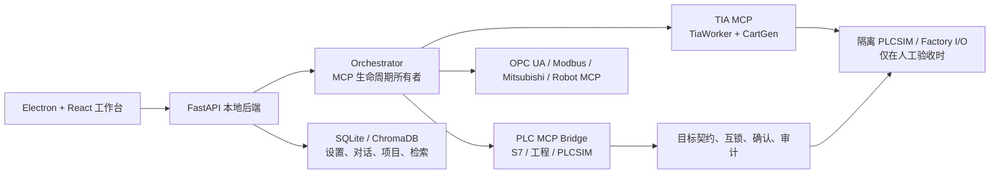

# AI 接入 PLC 与工业机器人

[English](README_EN.md) · 中文

> **项目定位：本地工业自动化 AI 工作台与受控仿真研发平台。**
> 它把自然语言、PLC 代码生成、TIA Portal 工程操作、PLCSIM、MCP 和本地桌面界面放在同一条可审计的研发链路中。它**不是**安全 PLC、急停回路替代品，也不是已通过真实产线认证的控制系统。

## 目录

- [项目目标与边界](#项目目标与边界)
- [当前状态](#当前状态)
- [能力地图](#能力地图)
- [系统架构](#系统架构)
- [仓库结构](#仓库结构)
- [安全模型](#安全模型)
- [环境与配置](#环境与配置)
- [本地启动与离线验证](#本地启动与离线验证)
- [受控仿真验收](#受控仿真验收)
- [API 与桌面工作台](#api-与桌面工作台)
- [文档、公开镜像与许可](#文档公开镜像与许可)

## 项目目标与边界

本项目面向 Windows 本地工程站，探索以下受控链路：

```text
自然语言需求
  → LLM 生成 LadderSpec / SCL 候选
  → JSON Schema 与语义安全检查
  → CartGen 生成 SimaticML / TIA Worker 操作工程
  → 编译与受控下载到隔离 PLCSIM
  → snap7 只读回读
  → 可选 Factory I/O 可视化
```

它同时包含一个 Electron + React 桌面工作台，用于 AI 对话、知识库检索、工程搜索、梯形图/代码生成、项目管理和受控工作流展示。

本仓库不承诺以下事项：

- 不把 AI、软件互锁或“影子仿真”视为急停、安全回路、F-CPU 或功能安全认证的替代品。
- 不允许将未验收的模型输出直接用于真实 PLC、生产网络或现场设备。
- 不以“进程已启动”“测试通过”或“代码可生成”宣称已完成 PLC 下载、CPU RUN、PLC 可读或工艺安全验收。
- 不提供任何 Siemens、Factory I/O、PLC 或工业机器人软件的许可证。

## 当前状态

截至 **2026-07-21**，下表是本仓库的当前证据边界：

| 范围 | 已确认的事实 | 不能据此推断的事实 |
| --- | --- | --- |
| 源码与离线回归 | `b27d08d` 上最近一次默认测试为 **714 passed，76 deselected**。`pytest.ini` 收集 `tests` 与 `orchestrator/tests`，并排除 `integration`、`hardware`、`desktop` 与 `network` 标记。 | 不代表 TIA、PLCSIM、Factory I/O、真实 PLC 或网络协议已动态通过。 |
| 桌面/后端 | FastAPI、React/Vite、Electron 配置、路由与工作流代码存在；根 `start.bat` 仅启动本地后端。前端 Vitest **136 测试通过**（11 文件，关键路径覆盖率 72%）；P0-P5 批次已修复 6 个 HIGH（不伪造原则：删除 Inspector/Dashboard 硬编码假数据 + 脱敏 testResult.reply + fallback headers 补 localControlHeaders），并完成 F-019 机器人 4 模式 + L3 安全等级 + 9 字段高风险确认、F-037 useTabs 单一 state object 根治、5 工具页 ToolStatusBar 10 状态机、附件上传真实 API、CSP `script-src 'self'` 收紧 + `connect-src` 环境变量化、ErrorBoundary 脱敏、9+ 处 `catch {}` 加日志。 | 不代表 Electron 打包、所有第三方模型或所有 UI 流程已在每台机器验证。E2E、Lighthouse、响应式 4 尺寸截图回归、OrchestratorPanel/ChatArea/InspectorPanel 文件拆分（P6/P7）尚未完成。 |
| TIA/PLCSIM 主链 | 受控 V21 目标、TIA Worker、CartGen、下载与 snap7 回读代码路径存在。 | 当前整改版本尚未完成 TIA V21 → PLCSIM Advanced V8 → snap7 → Factory I/O 的完整动态验收。有效的本地 PLCSIM Advanced 许可证、项目加载、下载成功与 CPU 可读均是独立前提。 |
| 真实现场 | 代码对控制目标、写入参数、认证主体、一次性确认和跨进程审计链设置了防护。 | 不代表可连接真实 PLC、F-CPU、安全回路或生产环境。当前 README 不授予此类操作权限。 |

历史状态文件、旧计划和旧架构图仅可作为线索。发生冲突时，请优先相信当前代码、`mcp-servers/tia-mcp/config.yaml`、测试配置和实际运行证据。

## 能力地图

| 模块 | 当前实现 | 使用边界 |
| --- | --- | --- |
| `ai-plc-assistant/` | Electron/React 前端与 FastAPI 本地后端；提供模型、对话、知识库、工程搜索、模板、生成、项目、设置、编排与 pipeline 路由。 | 本地开发工作台；控制类 API 需要本地会话令牌。 |
| `orchestrator/` | MCP 子进程连接池、工具注册、工作流引擎和单一生命周期所有者锁。运行时注册 S7 监测、TIA 多块、NL→PLCSIM、机器人 Pick & Place 与机器人监测工作流。 | 服务器连接失败会记录并继续；不应把“已注册工作流”误解为现场验收。 |
| `mcp-servers/tia-mcp/` | FastMCP、TIA Openness 调用、C# `TiaWorker`、.NET 8 `CartGen`、LadderSpec 校验、SCL/LAD 生成和 PLCSIM 辅助脚本。 | 面向受控 TIA V21 / 隔离 PLCSIM 目标；运行需要本机安装、权限与许可证。 |
| `mcp-servers/plc-mcp-bridge/` | S7 运行态、TIA 工程态、PLCSIM、Factory I/O、标签、块、UDT 与诊断工具的桥接层。 | 具有读写与工程变更能力的工具必须经安全门、目标约束和人工流程。 |
| `mcp-servers/{opcua,modbus,mitsubishi,robot}-mcp/` | OPC UA、Modbus TCP、三菱 MC 协议和机器人场景的 MCP 实验实现。 | 没有在真实硬件上完成统一验收；默认不应连接现场设备。 |
| `mcp_common/` 与 `safety/` | 统一配置、唯一控制目标、确认令牌、互锁、静态预检，以及带跨进程互斥的链式审计日志。 | 是软件防护层，不构成功能安全认证。 |
| `plc-code-templates/` | SCL、LAD、PLCopen/XML 和示例程序资产。 | 生成或模板存在不代表已经导入、编译或下载成功。 |
| `edge-gateway/` 与 `docker-compose.yml` | 可选的 Modbus、InfluxDB、Grafana、OpenPLC 与 AI 网关集成。 | 依赖独立环境变量、容器与网络配置；不属于默认离线启动路径。 |

## 系统架构



### 关键数据流

1. 桌面界面通过本地 `127.0.0.1` API 访问后端；Vite 开发代理指向端口 `8005`。
2. 后端启动时初始化知识库、搜索索引、对话/项目存储、设置存储以及编排层。
3. 后端取得 MCP 所有者锁后，编排层才可管理标准输入输出 MCP 子进程；第二个所有者必须失败关闭，避免重复拉起工具进程。
4. `nl_to_plcsim_pipeline` 把 Ladder 块创建、OB1 接入、编译、下载、snap7 只读回读和可选 Factory I/O 串为一条受控工作流。
5. 控制目标由 `mcp-servers/tia-mcp/config.yaml` 的 `target` 节统一定义。当前代码要求 V21、指定项目、`factoryio` 实例名和单一隔离 IP 一致；调用者不能通过任意 IP 或 OPC UA URL 绕过该契约。

### 梯形图与 TIA 路线

- 自然语言首先成为 LadderSpec/代码候选，而非被直接视为 PLC 指令。
- LadderSpec 经 JSON Schema 和语义规则检查后，`CartGen` 可生成 SimaticML；`TiaWorker` 是 C#/.NET Framework 4.8 的 TIA Openness 桥接入口。
- 受控下载策略以 TiaWorker 为优先级较高的路径，并保留其他兼容路径。任何下载成功结论仍应以 TIA 结果、PLCSIM CPU 状态和独立回读证据确认。

## 仓库结构

```text
.
├── ai-plc-assistant/          # 本地桌面工作台：React/Vite/Electron + FastAPI
├── orchestrator/              # MCP 连接池、工具注册、工作流与安全闸门
├── mcp-servers/
│   ├── tia-mcp/               # TIA V21、TiaWorker、CartGen、LAD/PLCSIM 相关路径
│   ├── plc-mcp-bridge/        # S7、工程、标签、块、PLCSIM、Factory I/O 桥接工具
│   ├── opcua-mcp/             # OPC UA MCP
│   ├── modbus-mcp/            # Modbus TCP MCP
│   ├── mitsubishi-mcp/        # 三菱 MC 协议 MCP
│   └── robot-mcp/             # Pick & Place/机器人实验工作流
├── mcp_common/                # 共享配置、控制目标、连接与审计
├── safety/                    # 互锁、确认令牌、静态预检与审计兼容层
├── plc-code-templates/        # SCL/LAD/PLCopen 等模板资产
├── edge-gateway/              # 可选边缘网关与监控集成
├── scripts/                   # 只读预检、链路报告和受控辅助脚本
├── tests/                     # 根级离线/安全回归测试
├── docs/                      # 领域、环境与历史技术文档
└── .plans/ai-plc-integration/ # 协作层、约束、历史计划与链路报告
```

## 安全模型

### 不可突破的原则

1. **急停和功能安全属于硬件/安全 PLC 领域。** AI 不应控制急停、F-CPU 参数或安全回路。
2. **唯一隔离目标。** `mcp_common/control_target.py` 只接受配置中的受控目标；S7 IP 与 OPC UA 端点漂移会被拒绝。
3. **写入默认拒绝。** 原始 S7 地址必须在 `safety/interlock-rules.yml` 中映射到安全语义与类型；S7、OPC UA、Modbus 与三菱的最终写入工具还必须拥有已登记的目标/值参数契约。未登记工具、缺少目标、类型不符、越界、互锁失败或静态预检失败都会拒绝。
4. **一次性人工确认。** 需要确认的写入和熔断复位必须使用签名、短时、绑定操作人/确认人/目标/值/设备身份的令牌；令牌消费后不可重用。当前 Modbus、三菱和 OPC UA 写入端点的审计主体从已验证凭据派生，不信任调用方自报身份。
5. **审计先于副作用。** 控制意图会先写入审计链。生产环境缺少持久 `AUDIT_HMAC_KEY` 或可信操作者身份时应失败关闭；日志会脱敏常见密钥字段，审计追加通过跨进程锁串行化以避免并发写入分叉。
6. **软件护栏不是认证。** 影子预检不模拟真实 PLC 扫描周期、现场接线、机械惯性或安全等级，不能替代隔离仿真、风险评估和人工签核。

### 本地控制 API

`POST /api/pipeline/nl-to-sim` 和编排层的控制路径要求 `X-Local-API-Token`，其值须与启动环境中的 `LOCAL_API_TOKEN` 相同。不要在浏览器、截图、日志、README 或 Git 中保存该令牌。

## 环境与配置

### 基础依赖

- Windows 工程站（TIA/PLCSIM/Factory I/O 路径为 Windows 场景）。
- Python 与 `requirements.txt` 中的依赖（FastAPI、FastMCP、python-snap7、asyncua、pymodbus、ChromaDB 等）。
- Node.js/npm（用于 `ai-plc-assistant/frontend` 的 React、Vite、Electron）。
- 仅在 TIA 路线需要：TIA Portal V21、匹配的 Openness 组件、PLCSIM Advanced V8、有效许可证，以及 CartGen 所需的 .NET 8 与 TiaWorker 所需的 .NET Framework 4.8。

### 配置文件

| 文件 | 用途 | 注意事项 |
| --- | --- | --- |
| `.env.example` | 根级环境变量模板，包含 TIA、PLCSIM、Factory I/O、协议和监控示例。 | 复制为 `.env` 后填写本机值；`.env` 已被 Git 忽略。不要提交。 |
| `ai-plc-assistant/backend/.env.example` | 桌面后端模型与服务配置模板。 | API Key 由系统凭据库/环境变量管理，不要写进项目设置 JSON。 |
| `mcp-servers/tia-mcp/config.yaml` | 受控目标与 TIA/仿真/安全配置源。 | 目标漂移会被校验拒绝；不要用历史 V18 配置替代当前 V21 目标。 |
| `safety/interlock-rules.yml` | 允许写入地址、类型、范围与互锁规则。 | 改动前应经独立安全审查和隔离验证。 |

最小本地变量示例（仅示意，使用你自己的随机值）：

```dotenv
DEEPSEEK_API_KEY=...
LOCAL_API_TOKEN=long-random-local-token
SAFETY_CONFIRMATION_SECRET=long-random-confirmation-secret
# 生产控制环境还必须单独配置：
AUDIT_HMAC_KEY=long-random-audit-key
```

## 本地启动与离线验证

### 1. 安装 Python 依赖

```powershell
cd "AI 接入PLC"
python -m pip install -r requirements.txt
```

项目当前 Windows 脚本固定使用 `D:\Python3\python.exe`。如果你的 Python 位于其他路径，请先修改脚本或改用等价的手动命令。

### 2. 配置环境变量

```powershell
Copy-Item .env.example .env
# 编辑 .env；只填写自己的 API Key、安装路径和隔离仿真目标。
git check-ignore .env
```

最后一条命令应表明 `.env` 被忽略。不要把实际 Key 粘贴到 issue、聊天记录、终端截图或提交信息中。

### 3. 启动本地后端

```powershell
.\start.bat
Invoke-RestMethod http://127.0.0.1:8005/api/health
```

根 `start.bat` 会运行预检并启动 FastAPI 后端；它不会自动启动 Electron、TIA Portal、PLCSIM、Factory I/O，也不会自行连接真实设备。

### 4. 启动桌面工作台（可选）

```powershell
cd ai-plc-assistant\frontend
npm ci
cd ..
.\start.bat
```

`ai-plc-assistant/start.bat` 需要端口 `8005` 与 `5173` 均未被占用，然后启动后端和 Vite/Electron 开发模式。打包命令位于前端 `package.json`：`npm run build`、`npm run pack` 与 `npm run dist`。

### 5. 运行默认离线测试

```powershell
$env:PYTHONDONTWRITEBYTECODE = "1"
D:\Python3\python.exe -m pytest -p no:cacheprovider -q
```

默认配置收集 `tests` 与 `orchestrator/tests`，并主动排除可能访问硬件、Windows 桌面或网络的标记。若要运行被排除的测试，必须先审阅测试代码、目标配置和副作用，且只能针对隔离环境。

## 受控仿真验收

`scripts/preflight.py --json` 是**只读环境门槛检查**，不是下载成功或 PLC 可读的证明：

```powershell
D:\Python3\python.exe scripts\preflight.py --json
```

只有在以下证据全部明确后，才可开展隔离仿真验收：

1. TIA Portal V21 已由人工打开，并加载受控项目。
2. `config.yaml` 的 V21、项目路径、PLCSIM 实例名和隔离 IP 与实际环境一致。
3. PLCSIM Advanced 有效、实例已创建且 CPU 状态可确认。
4. 下载结果在 TIA/PLCSIM 中可见，随后以 snap7 **只读**回读独立核验。
5. Factory I/O 仅在上述步骤成功后进行连接和场景验证。

任何一步失败，都应报告为“未验证”或“失败”，而不是以代码路径、测试数量或进程存在代替结论。

## API 与桌面工作台

FastAPI 在 `/api` 下注册以下能力组：

| 路由前缀 | 用途 |
| --- | --- |
| `/api/health` | 本地服务健康检查。 |
| `/api/models`、`/api/chat` | 本地模型配置与 AI 对话/SSE。 |
| `/api/knowledge`、`/api/search` | 文档知识库、模板检索与 PLC 工程搜索。 |
| `/api/prompts`、`/api/generate` | Prompt 模板、LAD/SCL/XML 候选生成与导出。 |
| `/api/conversations`、`/api/projects`、`/api/settings` | 本地会话、项目与设置管理。 |
| `/api/orchestrator` | MCP 服务器、工具、工作流、监控和确认相关接口。 |
| `/api/pipeline/nl-to-sim` | 受会话令牌保护的 NL→受控仿真工作流入口。 |

前端页面与 API 的存在仅说明功能入口已经实现。高风险操作仍需由后端、MCP 工具、安全模块和人工流程共同允许。

## 文档、公开镜像与许可

### 阅读顺序

1. [AGENTS.md](AGENTS.md)：当前工作区约束与安全边界。
2. [README_EN.md](README_EN.md)：本 README 的英文版。
3. [mcp-servers/tia-mcp/config.yaml](mcp-servers/tia-mcp/config.yaml)：受控目标配置。
4. [safety/interlock-rules.yml](safety/interlock-rules.yml)：写入允许范围与互锁。
5. [docs/environment.md](docs/environment.md) 与 [AI_CONTEXT.md](AI_CONTEXT.md)：环境和 PLC 领域背景。
6. `.plans/ai-plc-integration/docs/invariants.md`：不可破坏的工程约束。

`CURRENT_STATUS.md`、`PROJECT_HANDOVER.md`、历史架构图和旧计划可能落后于当前代码；阅读时请结合本 README 的状态边界。

### 文档维护

凡是改变用户可见能力、架构入口、控制/安全/认证边界、依赖、默认测试范围或验收结论的重大变更，必须在同一提交中同步更新本 README 与 [README_EN.md](README_EN.md)。纯内部重构若无需更新，应在审查或提交说明中明确原因。

### 两个仓库

- 私有主仓库：`yihefeikong-rgb/ai-plc-integration`
- 公开镜像：`yihefeikong-rgb/ai-plc-integration-public`

两者同步代码和文档前都应执行凭据检查。`.env`、日志、构建产物、缓存、TIA 项目二进制和已知大文件均不应提交。公开镜像只应包含可公开的源代码、模板和示例配置。

### 许可证

本仓库代码以 `LICENSE` 文件中的 MIT 许可证发布。TIA Portal、PLCSIM、Factory I/O 和相关工业软件的许可由各自权利人管理，本仓库不提供这些软件的许可证。
