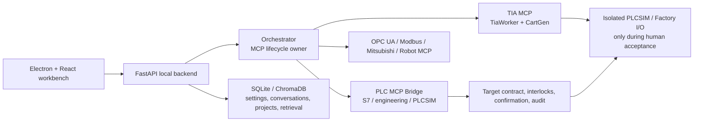

# AI PLC Integration and Industrial Robotics

[中文](README.md) · English

> **Positioning: a local industrial-automation AI workbench and controlled simulation R&D platform.**
> It connects natural-language workflows, PLC code generation, TIA Portal engineering operations, PLCSIM, MCP servers, and a local desktop UI in an auditable development path. It is **not** a safety PLC, an emergency-stop substitute, or a production-certified control system.

## Contents

- [Purpose and boundaries](#purpose-and-boundaries)
- [Current evidence status](#current-evidence-status)
- [Capability map](#capability-map)
- [Architecture](#architecture)
- [Repository layout](#repository-layout)
- [Safety model](#safety-model)
- [Environment and configuration](#environment-and-configuration)
- [Local startup and offline verification](#local-startup-and-offline-verification)
- [Controlled simulation acceptance](#controlled-simulation-acceptance)
- [API and desktop workbench](#api-and-desktop-workbench)
- [Documentation public mirror and license](#documentation-public-mirror-and-license)

## Purpose and boundaries

This Windows-oriented engineering repository explores the following controlled path:

```text
Natural-language requirement
  → LLM-generated LadderSpec / SCL candidate
  → JSON Schema and semantic safety checks
  → CartGen SimaticML generation / TIA Worker engineering operation
  → compile and controlled download to isolated PLCSIM
  → snap7 read-only readback
  → optional Factory I/O visualization
```

It also includes an Electron + React desktop workbench for AI chat, knowledge retrieval, project search, ladder/code generation, project management, and controlled workflow visibility.

This repository does **not** claim that:

- AI, software interlocks, or a shadow pre-check can replace emergency stops, safety circuits, F-CPUs, functional-safety certification, or a formal risk assessment.
- Unreviewed model output may be used on a real PLC, production network, or field device.
- A running process, passing unit test, or generated source proves that a project was downloaded, that a CPU is in RUN, that a PLC is readable, or that a process is safe.
- Siemens, Factory I/O, PLC, robot, or other third-party licenses are included.

## Current evidence status

As of **2026-07-14**, the repository has the following evidence boundary:

| Area | Confirmed fact | What must not be inferred |
| --- | --- | --- |
| Source and offline regression | The default offline suite reported **306 passed, 41 deselected**. Its configuration excludes `integration`, `hardware`, `desktop`, and `network` markers. | This does not validate TIA, PLCSIM, Factory I/O, a real PLC, or a network protocol dynamically. |
| Desktop and backend | FastAPI, React/Vite, Electron configuration, routes, and workflow code are present. The root `start.bat` launches the local backend only. | This does not prove Electron packaging, every external model, or every UI path on every machine. |
| TIA/PLCSIM path | A controlled V21 target, TIA Worker, CartGen, download path, and snap7 readback path exist in source. | The corrected revision has not completed end-to-end dynamic acceptance for TIA V21 → PLCSIM Advanced V8 → snap7 → Factory I/O. A valid local PLCSIM Advanced license, loaded project, successful download, and readable CPU are separate prerequisites. |
| Real field equipment | Code contains target, write, confirmation, and audit guards. | It does not authorize connection to real PLCs, F-CPUs, safety circuits, or production environments. |

Historical plans and status reports are clues only. When they conflict, prefer current source, `mcp-servers/tia-mcp/config.yaml`, test configuration, and direct runtime evidence.

## Capability map

| Module | Current implementation | Operational boundary |
| --- | --- | --- |
| `ai-plc-assistant/` | Electron/React UI and FastAPI local backend for models, chat, knowledge, search, templates, generation, projects, settings, orchestration, and pipeline APIs. | Local development workbench; control APIs require a local session token. |
| `orchestrator/` | MCP subprocess pool, tool registry, workflow engine, and single lifecycle-owner lock. Registers S7 monitoring, TIA multi-block, NL→PLCSIM, robot Pick & Place, and robot-monitor workflows. | A registered workflow is not evidence of field acceptance. |
| `mcp-servers/tia-mcp/` | FastMCP, TIA Openness calls, C# `TiaWorker`, .NET 8 `CartGen`, LadderSpec validation, SCL/LAD generation, and PLCSIM helper paths. | Requires compatible local TIA V21 installation, permissions, and licenses. |
| `mcp-servers/plc-mcp-bridge/` | Bridge tools for S7 runtime, TIA engineering, PLCSIM, Factory I/O, tags, blocks, UDTs, and diagnostics. | Read/write and engineering mutations require safety gates, target constraints, and human process. |
| `mcp-servers/{opcua,modbus,mitsubishi,robot}-mcp/` | Experimental MCP implementations for OPC UA, Modbus TCP, Mitsubishi MC protocol, and robot scenarios. | They have no unified real-hardware acceptance claim. Do not connect them to field devices by default. |
| `mcp_common/` and `safety/` | Shared configuration, single control target, confirmation tokens, interlocks, static pre-checks, and chained audit logging. | Engineering safeguards only; not a functional-safety certification. |
| `plc-code-templates/` | SCL, LAD, PLCopen/XML, and example PLC assets. | Presence of an asset does not prove import, compilation, or download success. |
| `edge-gateway/` and `docker-compose.yml` | Optional Modbus, InfluxDB, Grafana, OpenPLC, and AI gateway integration. | Needs separate variables, containers, and network configuration; not part of the default offline startup path. |

## Architecture



### Main data flow

1. The desktop UI calls a local `127.0.0.1` backend; the Vite development proxy targets port `8005`.
2. On startup, the backend initializes knowledge, search, conversation/project storage, application settings, and the orchestrator.
3. After acquiring the MCP owner lock, the backend may manage stdio MCP child processes. A second owner must fail closed to avoid duplicate tool processes.
4. `nl_to_plcsim_pipeline` links ladder-block creation, OB1 integration, compilation, download, snap7 read-only readback, and optional Factory I/O steps.
5. `mcp-servers/tia-mcp/config.yaml` defines the one controlled target. Current code requires the configured V21 version, project, `factoryio` instance, and isolated IP to agree; callers cannot use arbitrary S7 IPs or OPC UA URLs to bypass the contract.

### Ladder and TIA route

- A natural-language request becomes a LadderSpec/code candidate; it is not treated as a direct PLC command.
- LadderSpec is checked by JSON Schema and semantic rules before `CartGen` may produce SimaticML. `TiaWorker` is the C#/.NET Framework 4.8 bridge to TIA Openness.
- The controlled download path prioritizes TiaWorker and retains compatibility fallbacks. A download claim still requires independent TIA/PLCSIM state and readback evidence.

## Repository layout

```text
.
├── ai-plc-assistant/          # Local workbench: React/Vite/Electron + FastAPI
├── orchestrator/              # MCP pool, registry, workflows, safety gate
├── mcp-servers/
│   ├── tia-mcp/               # TIA V21, TiaWorker, CartGen, LAD/PLCSIM paths
│   ├── plc-mcp-bridge/        # S7, engineering, tags, blocks, PLCSIM, Factory I/O tools
│   ├── opcua-mcp/             # OPC UA MCP
│   ├── modbus-mcp/            # Modbus TCP MCP
│   ├── mitsubishi-mcp/        # Mitsubishi MC protocol MCP
│   └── robot-mcp/             # Pick & Place / robot experiments
├── mcp_common/                # Shared config, target, connection, and audit utilities
├── safety/                    # Interlocks, confirmation, static pre-check, audit compatibility
├── plc-code-templates/        # SCL/LAD/PLCopen template assets
├── edge-gateway/              # Optional gateway and monitoring integration
├── scripts/                   # Read-only preflight, chain report, controlled helpers
├── tests/                     # Offline and safety regression tests
├── docs/                      # Domain, environment, and historical technical documents
└── .plans/ai-plc-integration/ # Collaboration artifacts, constraints, historical plans, chain reports
```

## Safety model

### Non-negotiable principles

1. **Emergency stops and functional safety remain hardware/safety-PLC concerns.** AI must not control e-stops, F-CPU parameters, or safety circuits.
2. **One isolated target.** `mcp_common/control_target.py` accepts only the configured target; S7 IP and OPC UA endpoint drift is rejected.
3. **Writes fail closed.** A raw S7 address must be mapped in `safety/interlock-rules.yml` to a semantic target and type. Unmapped addresses, type mismatches, out-of-range values, interlock failures, or static-precheck failures are rejected.
4. **One-time human confirmation.** A required write needs a signed, short-lived token bound to operator, approver, target, value, device identity, and audit context. A consumed token cannot be reused.
5. **Audit before side effect.** Control intent is recorded before mutation. A production environment should fail closed without a persistent `AUDIT_HMAC_KEY` and an authenticated actor; common secret fields are redacted from logs.
6. **Software guards are not certification.** The static pre-check does not simulate real PLC scan cycles, field wiring, mechanical inertia, or safety integrity levels.

### Local control API

`POST /api/pipeline/nl-to-sim` and control-oriented orchestration routes require `X-Local-API-Token`, matching `LOCAL_API_TOKEN` in the startup environment. Never put that token in a browser capture, log, README, issue, or Git commit.

## Environment and configuration

### Baseline dependencies

- Windows engineering station for the TIA/PLCSIM/Factory I/O route.
- Python plus `requirements.txt` (FastAPI, FastMCP, python-snap7, asyncua, pymodbus, ChromaDB, and more).
- Node.js/npm for React, Vite, and Electron in `ai-plc-assistant/frontend`.
- For the TIA route only: TIA Portal V21, matching Openness components, PLCSIM Advanced V8 with a valid license, .NET 8 for CartGen, and .NET Framework 4.8 for TiaWorker.

### Important files

| File | Purpose | Important note |
| --- | --- | --- |
| `.env.example` | Root environment template for TIA, PLCSIM, Factory I/O, protocol, and monitoring settings. | Copy it to `.env`; `.env` is Git-ignored and must never be committed. |
| `ai-plc-assistant/backend/.env.example` | Desktop-backend model/service template. | Manage keys in environment variables or the OS credential store, not in application-settings JSON. |
| `mcp-servers/tia-mcp/config.yaml` | Source of controlled target and TIA/simulation/safety configuration. | Target drift is rejected; do not use historical V18 defaults instead of the current V21 target. |
| `safety/interlock-rules.yml` | Permitted write addresses, types, ranges, and interlocks. | Require independent safety review and isolated validation before changing it. |

Minimal local variables (illustrative only; use independently generated values):

```dotenv
DEEPSEEK_API_KEY=...
LOCAL_API_TOKEN=long-random-local-token
SAFETY_CONFIRMATION_SECRET=long-random-confirmation-secret
# Production control environments also require:
AUDIT_HMAC_KEY=long-random-audit-key
```

## Local startup and offline verification

### 1. Install Python dependencies

```powershell
cd "AI 接入PLC"
python -m pip install -r requirements.txt
```

The checked-in Windows scripts currently use `D:\Python3\python.exe`. If your interpreter is elsewhere, adjust the script locally or run the equivalent commands manually.

### 2. Configure the environment

```powershell
Copy-Item .env.example .env
# Edit .env with your own API key, installation paths, and isolated simulation target.
git check-ignore .env
```

The last command should confirm that `.env` is ignored. Never paste an actual key into an issue, chat transcript, terminal screenshot, or commit message.

### 3. Start the local backend

```powershell
.\start.bat
Invoke-RestMethod http://127.0.0.1:8005/api/health
```

The root `start.bat` performs preflight and starts the FastAPI backend. It does not automatically start Electron, TIA Portal, PLCSIM, Factory I/O, or a real-device connection.

### 4. Start the desktop workbench (optional)

```powershell
cd ai-plc-assistant\frontend
npm ci
cd ..
.\start.bat
```

`ai-plc-assistant/start.bat` requires both ports `8005` and `5173` to be free and then starts backend plus Vite/Electron development mode. The frontend package defines `npm run build`, `npm run pack`, and `npm run dist`.

### 5. Run the default offline suite

```powershell
$env:PYTHONDONTWRITEBYTECODE = "1"
D:\Python3\python.exe -m pytest -p no:cacheprovider -q
```

The default configuration runs only its offline scope and deliberately excludes tests marked for hardware, Windows desktop automation, or network access. Review test code, target configuration, and side effects before explicitly running excluded tests.

## Controlled simulation acceptance

`scripts/preflight.py --json` is a **read-only environment gate**, not proof of a successful download or readable PLC:

```powershell
D:\Python3\python.exe scripts\preflight.py --json
```

Before an isolated simulation acceptance run, obtain evidence for every item below:

1. An operator has opened TIA Portal V21 and loaded the controlled project.
2. The V21 version, project path, PLCSIM instance name, and isolated IP in `config.yaml` match the actual environment.
3. PLCSIM Advanced is valid, the instance exists, and CPU state can be confirmed.
4. The download result is visible in TIA/PLCSIM and then independently verified by **read-only** snap7 readback.
5. Factory I/O is connected and scenario-tested only after the preceding steps succeed.

If any step is missing, report it as **not verified** or **failed**. Do not substitute code paths, test volume, or process presence for evidence.

## API and desktop workbench

FastAPI registers these API groups under `/api`:

| Prefix | Purpose |
| --- | --- |
| `/api/health` | Local service health check. |
| `/api/models`, `/api/chat` | Local model configuration and AI chat/SSE. |
| `/api/knowledge`, `/api/search` | Knowledge base, template retrieval, and PLC-project search. |
| `/api/prompts`, `/api/generate` | Prompt templates and LAD/SCL/XML candidate generation/export. |
| `/api/conversations`, `/api/projects`, `/api/settings` | Local conversations, projects, and settings. |
| `/api/orchestrator` | MCP server, tool, workflow, monitoring, and confirmation APIs. |
| `/api/pipeline/nl-to-sim` | Local-session-token-protected NL-to-controlled-simulation entry point. |

An endpoint or UI control being present means an entry point exists. High-risk operations still require backend, MCP, safety, and human-process approval together.

## Documentation, public mirror, and license

### Suggested reading order

1. [AGENTS.md](AGENTS.md) — current workspace constraints and safety boundary.
2. [README.md](README.md) — Chinese version of this document.
3. [mcp-servers/tia-mcp/config.yaml](mcp-servers/tia-mcp/config.yaml) — controlled target configuration.
4. [safety/interlock-rules.yml](safety/interlock-rules.yml) — allowed write scope and interlocks.
5. [docs/environment.md](docs/environment.md) and [AI_CONTEXT.md](AI_CONTEXT.md) — environment and PLC-domain background.
6. `.plans/ai-plc-integration/docs/invariants.md` — non-breakable engineering constraints.

`CURRENT_STATUS.md`, `PROJECT_HANDOVER.md`, older architecture diagrams, and historical plans can lag current code. Read them with the evidence boundary above.

### Two repositories

- Private primary repository: `yihefeikong-rgb/ai-plc-integration`
- Public mirror: `yihefeikong-rgb/ai-plc-integration-public`

Both repositories should undergo a credential check before synchronization. Do not commit `.env`, logs, build outputs, caches, TIA project binaries, or known large artifacts. The public mirror should contain only publishable source, templates, and example configuration.

### License

The code in this repository is released under the MIT license (see `LICENSE`). TIA Portal, PLCSIM, Factory I/O, and other industrial software remain subject to their respective licenses, which this repository does not provide.
